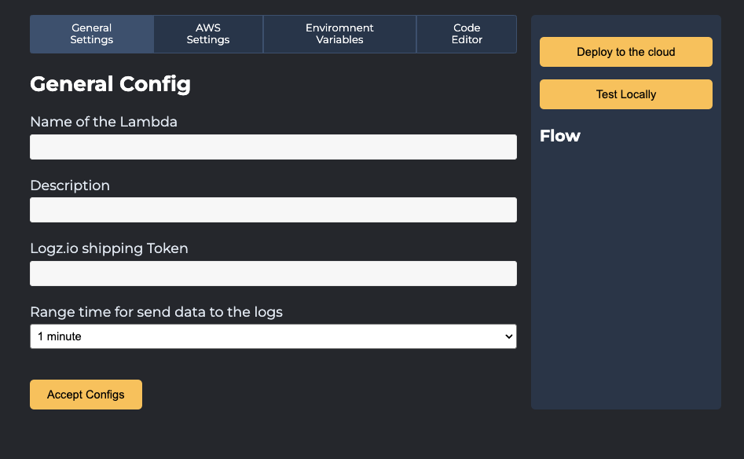
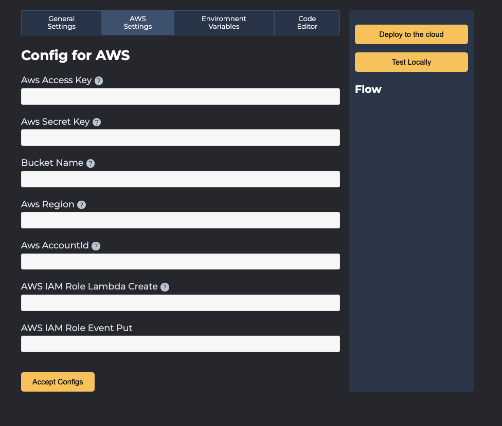
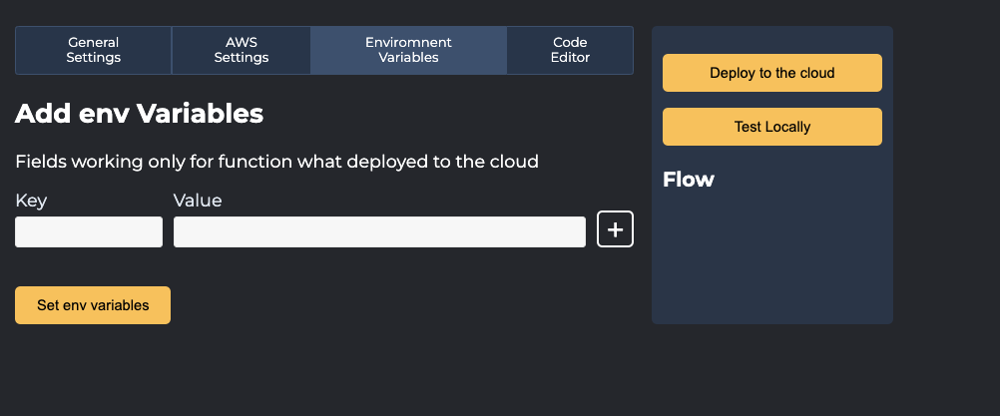
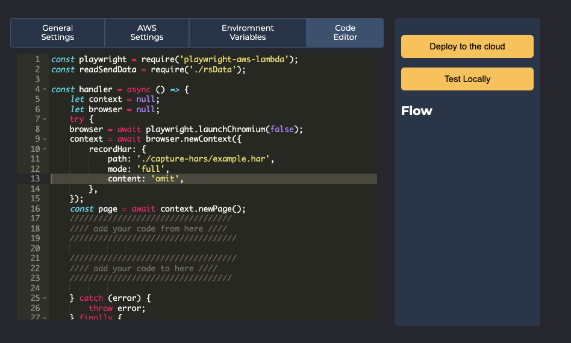
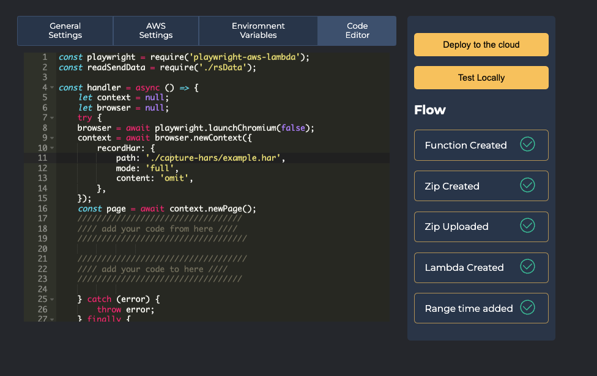

# synthetic-scripting

## Run Application

1. Pull the Docker image.

`docker pull logzio/synthetic-script:latest`

2. Run the Docker container.

`docker run -p 8080:8080 -d --name synthetic-script logzio/synthetic-script:latest`

Docker image will run a Node.js mini app. Open http://localhost:8080 in your Browser to access the UI that helps you establish connection between your app and Logz.io.

## Define a script for running the test

1. In tab `General Settings`, fill in all the required fields.

| Field                                           | Description                                                                                                                 |
| ----------------------------------------------- | --------------------------------------------------------------------------------------------------------------------------- |
| Name of the Lambda (Required)                   | Lambda function name what will be created. This name will also be used to identify the Lambda function in Logz.io Dashboard |
| Description (Optional)                          | Lambda function description                                                                                                 |
| Logz.io shipping Token (Required)               | Your Logz.io logs shipping token.                                                                                           |
| Time range for sending logs (Default: 1 minute) | Define the range in a minutes to run a Lambda function (using cloudBridge event)                                            |

2. On a Second tab `Aws Settings` you will see. Please fill all reqiured fields.

| Field                     | Description                                                                                                                                                                                                                                                                                                                                                                                                                                                                                                                 |
| ------------------------- | --------------------------------------------------------------------------------------------------------------------------------------------------------------------------------------------------------------------------------------------------------------------------------------------------------------------------------------------------------------------------------------------------------------------------------------------------------------------------------------------------------------------------- |
| Aws Access Key (Required) | Your AWS access key ID.                                                                                                                                                                                                                                                                                                                                                                                                                                                                                                     |
| Aws Secret Key (Required) | Your AWS secret key ID.                                                                                                                                                                                                                                                                                                                                                                                                                                                                                                     |
| Bucket Name (Required)    | The bucket name to which the PUT action is initiated. When using this action with an access point, you must direct requests to the access point hostname. The access point hostname takes the form AccessPointName-AccountId.s3-accesspoint.Region.amazonaws.com. When using this action with an access point through the Amazon Web Services SDKs, you need to provide the access point ARN instead of the bucket name. For more information about access point ARNs, see Using access points in the Amazon S3 User Guide. |
| Aws Region (Required)     | Your AWS region to send service requests to.                                                                                                                                                                                                                                                                                                                                                                                                                                                                                |

2. On a Third tab `Enviroment Variables` you will see.

Here you can define the environment variable that can be attached to your Lambda function. You can use it in the Code Editor as `process.env.KEY`. You can define the KEY parameter, which will be present in the Lambda function

3. On A Fourth tab `Code Editor` you will see.

Here you can define the code for your test using [playwright.dev](https://playwright.dev). Put your code between the comments.

4. After setting all the values and defining the test code,
   click `Test locally` to check if everything works ad the logs are generated.
   To deploy the Lambda function, click `Deploy to the cloud`. You will see status of all the steps running in the background. The following message appears when the checks are completed:

## Check Logz.io for your metrics

Give your metrics a few minutes to get from your system to ours,
and then open [Logz.io](https://app.logz.io/#/dashboard/metrics).

## Changelong

1.0.0:

-   Initial Release

## License

Licensed under the [Apache 2.0](http://apache.org/licenses/LICENSE-2.0.txt) License.
