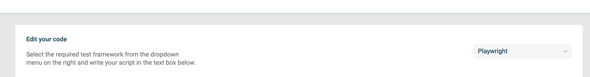

# Synthetic scripting

This Synthetic scripting mini app emulates and monitors your custom user experience by scripting browsers that navigate to your website, take specific actions, and ensure specific elements are present. The Synthetic scripting app helps to define tests (using frameworks, such as [playwright](https://playwright.dev/)) for your custom user experience.

## Run Application

1. Pull the Docker image.

```sh
docker pull logzio/synthetic-script:latest
```

2. Run the Docker container.

```sh
docker run -p 8080:8080 -d --name synthetic-script logzio/synthetic-script:latest
```

The Docker image will run a Node.js mini app. Navigate to http://localhost:8080 in your browser to access the UI that helps you establish connection between your app and Logz.io.

## Define a script for running the test


1. Select the required framework for your test code from the Framework selector dropdown.
   

2. Enter your code into the Code editor.
   

Here you can define the code for your test using [playwright.dev](https://playwright.dev). Put your code between the comments.

Click the **Test Script** button to check if the code runs correctly.

3. Define environment variables in the Environment Variables manager.
   

In the Environment Variables manager you can define environment variables that can be attached to your Lambda function. You can use them in the Code editor as `process.env.KEY` and define the `KEY` parameter, which will be present in the Lambda function.

**NOTE:** Prior to testing the code locally, fill in the KEY-VALUE fields for all environment variables used.

4. Download the code as a template or deploy it directly to your cloud provider, using the `Explore/deploy` tab.

## Download as a template

Open the tab to download the code as a template and fill in the parameters as per the parameters table.


## Deploy directly to the cloud

Open the tab to deploy the code directly to the cloud and fill in the parameters as per the parameters table.


| Parameter                         | Description                                                                                                                                                                                                                                                                                                                                                                                                                                                                                                                          |
| --------------------------------- | ------------------------------------------------------------------------------------------------------------------------------------------------------------------------------------------------------------------------------------------------------------------------------------------------------------------------------------------------------------------------------------------------------------------------------------------------------------------------------------------------------------------------------------ |
| Name of the Lambda (Required)     | Name of the Lambda function that will be created. This name will also be used to identify the Lambda function in the Logz.io dashboard.                                                                                                                                                                                                                                                                                                                                                                                              |
| Description (Optional)            | Lambda function description.                                                                                                                                                                                                                                                                                                                                                                                                                                                                                                         |
| Logz.io shipping Token (Required) | Your Logz.io logs shipping token.                                                                                                                                                                                                                                                                                                                                                                                                                                                                                                    |
| Schedule Rate (Default: 1 minute) | Range in a minutes to run a Lambda function (using cloudBridge event).                                                                                                                                                                                                                                                                                                                                                                                                                                                               |
| Aws Access Key (Required)         | Your AWS access key ID. \*`Requires for Deploy to Cloud option for platform`.                                                                                                                                                                                                                                                                                                                                                                                                                                                        |
| Aws Secret Key (Required)         | Your AWS secret key ID.\*`Requires for Deploy to Cloud option for platform`.                                                                                                                                                                                                                                                                                                                                                                                                                                                         |
| Bucket Name (Required)            | The bucket name to which the PUT action will be initiated. When using this action with an access point, you must direct requests to the access point hostname. The access point hostname takes the form AccessPointName-AccountId.s3-accesspoint.Region.amazonaws.com. When using this action with an access point through the Amazon Web Services SDKs, you need to provide the access point ARN instead of the bucket name. For more information about access point ARNs, see **Using access points** in the Amazon S3 User Guide. |
| Aws Region (Required)             | Your AWS region to send service requests to.                                                                                                                                                                                                                                                                                                                                                                                                                                                                                         |

After deploying to the Cloud you will see that screen


## Check Logz.io for your metrics

Give your metrics a few minutes to get from your system to ours,
and then open [Logz.io](https://app.logz.io/#/dashboard/metrics).

## Changelong

1.1.9:

-   Add support to run a tests on different mobile devices

1.1.8:

-   Add Option to choose device where need to run user flow

1.1.7:

-   Add first invocation after cloud function was uploaded

1.1.6:

-   fix typo in `log type`

-   update yml file to add policy for use S3

-   add region and geolocation to logs

1.1.5:

-   Update sheduler name from static to dynamic

1.1.4:

-   Update the playwright from 1.24.0 to 1.30.0

-   Add dropdown UI for regions select

1.1.3:

-   Update UI

1.1.2:

-   Update docker image, to upload playwright to the Docker.
-   CSS fix, update test status box.
-   Add cleanup for useEffect

1.1.1:
Refactor Components:

-   Move from type to interfaces.

Add to summaryLog:

-   totalDuration

1.1.0:

-   Update UI
-   Initial Release

1.0.0:

-   Initial Release

## License

Licensed under the [Apache 2.0](http://apache.org/licenses/LICENSE-2.0.txt) License.
